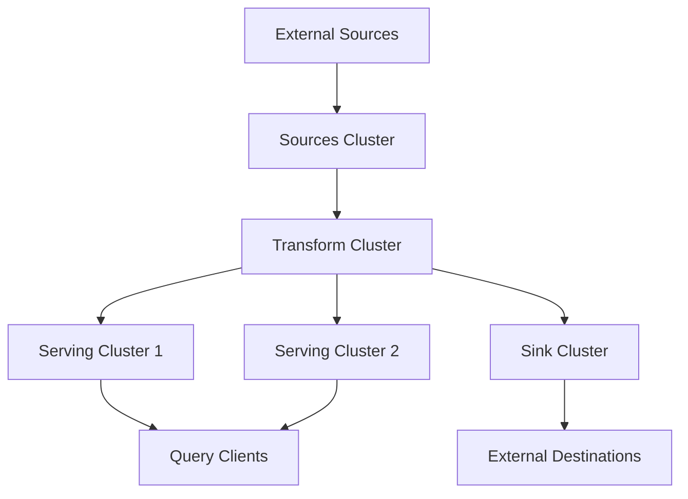

## Overview

Clusters are pools of **compute resources** (CPU, memory, and scratch disk space) for running workloads in Materialize. Every operation that requires computation — maintaining sources, indexes, materialized views, or executing queries — must run on a cluster.

```sql
-- Create a cluster
CREATE CLUSTER transform_cluster SIZE = '100cc';

-- Use it for a materialized view
CREATE MATERIALIZED VIEW customer_metrics
IN CLUSTER transform_cluster AS
SELECT 
    customer_id,
    COUNT(*) as order_count
FROM orders
GROUP BY customer_id;
```

<Info>
Clusters provide **resource isolation** — workloads on different clusters cannot interfere with each other's performance.
</Info>

## What Requires Clusters

The following operations require compute resources and must be associated with a cluster:

<CardGroup cols={2}>
  <Card title="Sources" icon="database">
    Continuously ingesting data from external systems
    
    ```sql
    CREATE SOURCE kafka_events
    IN CLUSTER source_cluster
    FROM KAFKA CONNECTION kafka_conn
    (TOPIC 'events')
    FORMAT JSON;
    ```
  </Card>
  
  <Card title="Materialized Views" icon="table">
    Incrementally maintaining query results
    
    ```sql
    CREATE MATERIALIZED VIEW summary
    IN CLUSTER transform_cluster AS
    SELECT * FROM orders;
    ```
  </Card>
  
  <Card title="Indexes" icon="bolt">
    Storing results in memory for fast queries
    
    ```sql
    CREATE INDEX idx
    IN CLUSTER serving_cluster
    ON my_view(customer_id);
    ```
  </Card>
  
  <Card title="Sinks" icon="arrow-right">
    Streaming data to external systems
    
    ```sql
    CREATE SINK kafka_sink
    IN CLUSTER sink_cluster
    FROM my_view
    INTO KAFKA CONNECTION kafka_conn
    (TOPIC 'output')
    FORMAT JSON;
    ```
  </Card>
  
  <Card title="Queries" icon="search">
    Executing ad-hoc SELECT and SUBSCRIBE
    
    ```sql
    SET CLUSTER = serving_cluster;
    
    SELECT * FROM my_view
    WHERE customer_id = 'CUST-123';
    ```
  </Card>
</CardGroup>

## Resource Isolation

Clusters provide **strict resource isolation**:

```
┌──────────────────┐     ┌──────────────────┐     ┌──────────────────┐
│  Source Cluster  │     │ Transform Cluster│     │ Serving Cluster  │
│  - CPU: 4 cores  │     │  - CPU: 8 cores  │     │  - CPU: 4 cores  │
│  - RAM: 16 GB    │     │  - RAM: 32 GB    │     │  - RAM: 16 GB    │
│  - Disk: 100 GB  │     │  - Disk: 200 GB  │     │  - Disk: 100 GB  │
└──────────────────┘     └──────────────────┘     └──────────────────┘
```

**Key properties**:
- Workloads on one cluster **cannot** consume resources from another
- Clusters can **fail independently** without affecting others
- Each cluster has its **own memory** for indexes and arrangements
- Queries in one cluster **cannot use** indexes from another

<Warning>
If a cluster runs out of memory or CPU, only workloads on **that cluster** are affected. Other clusters continue operating normally.
</Warning>

## Cluster Sizing

Clusters are sized using **compute credits (cc)**, which determine resource allocation:

| Size | vCPU | Memory | Disk | Use Case |
|------|------|--------|------|----------|
| `25cc` | 1 | 4 GB | 25 GB | Development, light workloads |
| `50cc` | 2 | 8 GB | 50 GB | Small production sources/sinks |
| `100cc` | 4 | 16 GB | 100 GB | Medium production workloads |
| `200cc` | 8 | 32 GB | 200 GB | Large transforms, many indexes |
| `400cc` | 16 | 64 GB | 400 GB | Heavy aggregations, large state |
| `600cc` | 24 | 96 GB | 600 GB | Very large workloads |
| `800cc` | 32 | 128 GB | 800 GB | Extreme scale |

### Creating Clusters

```sql
-- Small cluster for development
CREATE CLUSTER dev_cluster SIZE = '25cc';

-- Medium cluster for production sources
CREATE CLUSTER source_cluster SIZE = '100cc';

-- Large cluster for complex transformations
CREATE CLUSTER transform_cluster SIZE = '400cc';

-- Cluster with multiple replicas for fault tolerance
CREATE CLUSTER ha_cluster (
    SIZE = '200cc',
    REPLICATION FACTOR = 2
);
```

### Resizing Clusters

Clusters can be resized dynamically:

```sql
-- Scale up for increased load
ALTER CLUSTER transform_cluster SET (SIZE = '400cc');

-- Scale down during low-traffic periods
ALTER CLUSTER transform_cluster SET (SIZE = '100cc');
```

<Tip>
Use the **Environment Overview** page in the Materialize Console to monitor CPU and memory utilization before resizing.
</Tip>

## Replication and Fault Tolerance

Clusters support **replication** for fault tolerance:

```sql
CREATE CLUSTER ha_cluster (
    SIZE = '200cc',
    REPLICATION FACTOR = 3  -- 3 replicas
);
```

Each replica:
- Provisions a **separate pool** of compute resources
- Performs **exactly the same work** on the same data
- Runs in a **different availability zone** for hardware fault tolerance

### How Replication Works

```
┌─────────────────────────────────────────┐
│            HA Cluster (3 replicas)       │
├───────────────┬───────────────┬──────────┤
│   Replica r1  │   Replica r2  │ Replica r3│
│   AZ: us-1a   │   AZ: us-1b   │ AZ: us-1c │
│   Same work   │   Same work   │ Same work │
│   Same data   │   Same data   │ Same data │
└───────────────┴───────────────┴───────────┘
```

**Benefits**:
- If one replica fails (hardware issue, network partition), others continue serving
- Queries are routed to healthy replicas automatically
- Indexes and materialized views remain available

<Info>
**Cost consideration**: Each replica consumes resources. A cluster with `REPLICATION FACTOR = 3` uses 3× the resources of a single-replica cluster.
</Info>

### Manual Replica Management

For fine-grained control:

```sql
-- Create cluster without replicas
CREATE CLUSTER manual_cluster (SIZE = '100cc', REPLICATION FACTOR = 0);

-- Add replicas manually
CREATE CLUSTER REPLICA manual_cluster.r1 SIZE = '100cc';
CREATE CLUSTER REPLICA manual_cluster.r2 SIZE = '100cc';
CREATE CLUSTER REPLICA manual_cluster.r3 SIZE = '200cc';  -- Larger replica

-- Drop a replica
DROP CLUSTER REPLICA manual_cluster.r3;
```

## Three-Tier Architecture

For production workloads, use a **three-tier architecture** to separate concerns:



### Tier 1: Sources Cluster

```sql
CREATE CLUSTER source_cluster SIZE = '100cc';

CREATE SOURCE pg_source
IN CLUSTER source_cluster
FROM POSTGRES CONNECTION pg_conn
(PUBLICATION 'mz_source');

CREATE SOURCE kafka_events
IN CLUSTER source_cluster
FROM KAFKA CONNECTION kafka_conn (TOPIC 'events')
FORMAT JSON;
```

**Purpose**: Dedicate resources to data ingestion

**Characteristics**:
- Handles network I/O from external systems
- Manages replication slots (PostgreSQL) or consumer groups (Kafka)
- Sizes based on ingestion throughput and number of sources

### Tier 2: Transform Cluster

```sql
CREATE CLUSTER transform_cluster SIZE = '400cc';

CREATE MATERIALIZED VIEW enriched_orders
IN CLUSTER transform_cluster AS
SELECT 
    o.order_id,
    c.customer_name,
    p.product_name,
    o.quantity,
    o.amount
FROM pg_source_orders o
JOIN pg_source_customers c ON o.customer_id = c.id
JOIN pg_source_products p ON o.product_id = p.id;

CREATE MATERIALIZED VIEW daily_metrics
IN CLUSTER transform_cluster AS
SELECT 
    DATE_TRUNC('day', order_time) as day,
    COUNT(*) as order_count,
    SUM(amount) as revenue
FROM enriched_orders
GROUP BY day;
```

**Purpose**: Perform expensive transformations

**Characteristics**:
- Hosts materialized views (no indexes)
- Performs joins, aggregations, and complex SQL
- Sizes based on transformation complexity and data volume
- Results stored in durable storage, accessible from any cluster

### Tier 3: Serving Clusters

```sql
CREATE CLUSTER serving_cluster SIZE = '100cc';

-- Index materialized views from transform cluster
CREATE INDEX idx_enriched IN CLUSTER serving_cluster
ON enriched_orders(order_id);

CREATE INDEX idx_metrics IN CLUSTER serving_cluster
ON daily_metrics(day);

-- Execute queries against indexes
SET CLUSTER = serving_cluster;

SELECT * FROM enriched_orders
WHERE order_id = 12345;  -- Instant lookup from index
```

**Purpose**: Serve queries with low latency

**Characteristics**:
- Indexes materialized views for fast access
- Serves SELECT and SUBSCRIBE queries
- Sizes based on index memory requirements and query concurrency
- Can have multiple serving clusters for different workloads

<Tip>
**Why separate tiers?**
- **Isolation**: Expensive transformations don't slow down queries
- **Scaling**: Scale ingestion, transformation, and serving independently
- **Cost**: Right-size each tier for its specific needs
- **Failure domain**: Problems in one tier don't affect others
</Tip>

## Alternative Architectures

### Two-Tier Architecture

For simpler workloads:

```sql
-- Tier 1: Ingest + Transform
CREATE CLUSTER ingest_cluster SIZE = '200cc';

CREATE SOURCE pg_source IN CLUSTER ingest_cluster
FROM POSTGRES CONNECTION pg_conn (PUBLICATION 'mz_source');

CREATE MATERIALIZED VIEW metrics IN CLUSTER ingest_cluster AS
SELECT customer_id, COUNT(*) FROM pg_source_orders
GROUP BY customer_id;

-- Tier 2: Serve
CREATE CLUSTER serving_cluster SIZE = '100cc';

CREATE INDEX idx_metrics IN CLUSTER serving_cluster
ON metrics(customer_id);
```

### Single-Cluster Architecture

For development or low-volume production:

```sql
CREATE CLUSTER quickstart SIZE = '100cc';

-- Everything on one cluster
CREATE SOURCE pg_source IN CLUSTER quickstart
FROM POSTGRES CONNECTION pg_conn (PUBLICATION 'mz_source');

CREATE MATERIALIZED VIEW metrics IN CLUSTER quickstart AS
SELECT customer_id, COUNT(*) FROM pg_source_orders
GROUP BY customer_id;

CREATE INDEX idx_metrics IN CLUSTER quickstart
ON metrics(customer_id);
```

<Warning>
Single-cluster architectures lack workload isolation. Use only for non-production or low-traffic applications.
</Warning>

## Hydration and Memory

When materialized views or indexes are created (or clusters restart), they undergo **hydration**:

```sql
CREATE MATERIALIZED VIEW customer_summary AS
SELECT 
    customer_id,
    COUNT(*) as order_count,
    SUM(total) as lifetime_value
FROM orders  -- 100M rows, 10 GB
GROUP BY customer_id;  -- 1M customers, 100 MB output
```

**During hydration**:
- Memory usage: ~10 GB (input) + 100 MB (output) = **~10 GB**
- After hydration: 100 MB (steady state)

<Tip>
**Sizing tip**: Cluster must have enough memory for hydration peaks, not just steady-state usage. Monitor during initial creation.
</Tip>

## System Clusters

Materialize includes built-in system clusters:

| Cluster | Purpose | Modifiable |
|---------|---------|------------|
| `mz_system` | Internal catalog operations | No |
| `mz_catalog_server` | System catalog queries | No |
| `mz_probe` | System health checks | No |
| `default` | User workloads (deprecated) | Yes |

<Warning>
Avoid using the `default` cluster for production workloads. Create dedicated clusters instead.
</Warning>

```sql
-- Check current cluster
SHOW CLUSTER;

-- Switch to a different cluster
SET CLUSTER = serving_cluster;

-- Create objects in specific cluster
CREATE INDEX idx IN CLUSTER serving_cluster ON my_view(id);
```

## Monitoring Clusters

### Resource Utilization

```sql
-- View cluster resource usage
SELECT 
    c.name,
    c.size,
    pg_size_pretty(SUM(arr.size)) as memory_used
FROM mz_clusters c
JOIN mz_indexes i ON i.cluster_id = c.id
JOIN mz_arrangement_sizes arr ON i.id = arr.object_id
GROUP BY c.name, c.size;
```

### Dataflow Health

```sql
-- Check for errors in dataflows
SELECT 
    c.name as cluster,
    d.name as dataflow,
    ds.status,
    ds.error
FROM mz_clusters c
JOIN mz_dataflows d ON d.cluster_id = c.id
JOIN mz_internal.mz_dataflow_statuses ds ON d.id = ds.dataflow_id
WHERE ds.status != 'running';
```

### Replica Status

```sql
-- View replica health
SELECT 
    c.name as cluster,
    r.name as replica,
    r.size,
    rs.status
FROM mz_clusters c
JOIN mz_cluster_replicas r ON r.cluster_id = c.id
JOIN mz_internal.mz_cluster_replica_statuses rs ON r.id = rs.replica_id;
```

## Cost Management

Clusters are billed based on:
- **Size**: Larger clusters cost more per hour
- **Replication factor**: Multiple replicas multiply costs
- **Uptime**: Charges accrue while cluster is running

```sql
-- Drop clusters when not needed
DROP CLUSTER dev_cluster;

-- Resize to smaller size during off-hours
ALTER CLUSTER transform_cluster SET (SIZE = '100cc');

-- Reduce replication for non-critical workloads
ALTER CLUSTER staging_cluster SET (REPLICATION FACTOR = 1);
```

<Tip>
Use the **Billing** page in the Materialize Console to track compute costs by cluster.
</Tip>

## Best Practices

<AccordionGroup>
  <Accordion title="Separate Production and Development">
    Create isolated clusters for different environments:
    ```sql
    CREATE CLUSTER prod_cluster SIZE = '400cc', REPLICATION FACTOR = 3;
    CREATE CLUSTER dev_cluster SIZE = '25cc', REPLICATION FACTOR = 1;
    ```
  </Accordion>
  
  <Accordion title="Use Three-Tier Architecture">
    Separate ingestion, transformation, and serving:
    - **Sources cluster**: Dedicated to data ingestion
    - **Transform cluster**: Materialized views only (no indexes)
    - **Serving clusters**: Indexes for fast queries
  </Accordion>
  
  <Accordion title="Monitor Before Resizing">
    Check CPU and memory utilization:
    ```sql
    SELECT * FROM mz_internal.mz_cluster_replica_metrics
    WHERE cluster_id = (SELECT id FROM mz_clusters WHERE name = 'my_cluster');
    ```
    Resize when utilization consistently exceeds 70-80%.
  </Accordion>
  
  <Accordion title="Plan for Hydration">
    Ensure clusters have enough memory for initial hydration:
    - Estimate input + output size
    - Test with smaller datasets first
    - Monitor during first materialized view creation
  </Accordion>
  
  <Accordion title="Use Replication for Critical Workloads">
    Production serving clusters should have multiple replicas:
    ```sql
    CREATE CLUSTER prod_serving SIZE = '200cc', REPLICATION FACTOR = 2;
    ```
    Balances availability and cost.
  </Accordion>
</AccordionGroup>

## Example: Complete Production Architecture

```sql
-- Tier 1: Sources (moderate size, HA)
CREATE CLUSTER source_cluster (
    SIZE = '100cc',
    REPLICATION FACTOR = 2
);

CREATE SOURCE pg_source IN CLUSTER source_cluster
FROM POSTGRES CONNECTION pg_conn (PUBLICATION 'mz_source');

CREATE SOURCE kafka_events IN CLUSTER source_cluster
FROM KAFKA CONNECTION kafka_conn (TOPIC 'events')
FORMAT JSON;

-- Tier 2: Transform (large size for complex queries, HA)
CREATE CLUSTER transform_cluster (
    SIZE = '400cc',
    REPLICATION FACTOR = 2
);

CREATE MATERIALIZED VIEW enriched_orders
IN CLUSTER transform_cluster AS
SELECT 
    o.order_id,
    c.customer_name,
    p.product_name,
    o.quantity * p.price as total
FROM pg_source_orders o
JOIN pg_source_customers c ON o.customer_id = c.id
JOIN pg_source_products p ON o.product_id = p.id;

CREATE MATERIALIZED VIEW realtime_metrics
IN CLUSTER transform_cluster AS
SELECT 
    DATE_TRUNC('minute', order_time) as minute,
    COUNT(*) as order_count,
    SUM(total) as revenue
FROM enriched_orders
GROUP BY minute;

-- Tier 3a: Serving for customer queries (HA)
CREATE CLUSTER serving_customer (
    SIZE = '100cc',
    REPLICATION FACTOR = 2
);

CREATE INDEX idx_orders IN CLUSTER serving_customer
ON enriched_orders(customer_id);

-- Tier 3b: Serving for analytics dashboard (HA)
CREATE CLUSTER serving_analytics (
    SIZE = '200cc',
    REPLICATION FACTOR = 2
);

CREATE INDEX idx_metrics IN CLUSTER serving_analytics
ON realtime_metrics(minute);

-- Tier 4: Sinks (smaller size, HA optional)
CREATE CLUSTER sink_cluster (
    SIZE = '50cc',
    REPLICATION FACTOR = 1
);

CREATE SINK metrics_sink IN CLUSTER sink_cluster
FROM realtime_metrics
INTO KAFKA CONNECTION kafka_conn (TOPIC 'metrics')
FORMAT JSON;
```

## Next Steps

<CardGroup cols={2}>
  <Card title="Create Sources" icon="database" href="/concepts/sources">
    Connect to external data systems
  </Card>
  <Card title="Build Materialized Views" icon="table" href="/concepts/materialized-views">
    Transform data with SQL
  </Card>
  <Card title="SQL Reference" icon="book" href="/sql/create-cluster">
    Complete CREATE CLUSTER syntax
  </Card>
  <Card title="Operational Guidelines" icon="list-check" href="/manage/operational-guidelines">
    Production deployment best practices
  </Card>
</CardGroup>
