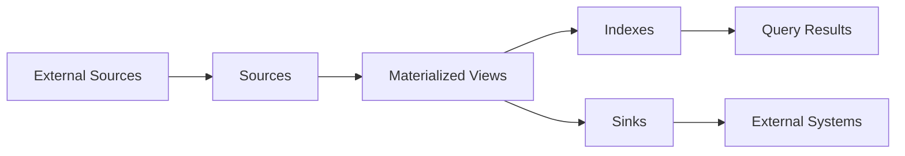

## Introduction

Materialize is a real-time data integration platform that creates and continually updates consistent views of transactional data. Built on top of **differential dataflow** and **timely dataflow**, Materialize enables SQL-based stream processing with strong consistency guarantees.

This section introduces the core architectural concepts that make Materialize unique:

<CardGroup cols={2}>
  <Card title="Sources" icon="database" href="/concepts/sources">
    Connect to external systems like Kafka, PostgreSQL, and MySQL
  </Card>
  <Card title="Materialized Views" icon="chart-line" href="/concepts/materialized-views">
    Incrementally maintain query results in durable storage
  </Card>
  <Card title="Indexes" icon="memory" href="/concepts/indexes">
    Store query results in memory for instant access
  </Card>
  <Card title="Sinks" icon="arrow-right-from-bracket" href="/concepts/sinks">
    Push data to external systems like Kafka
  </Card>
  <Card title="Clusters" icon="server" href="/concepts/clusters">
    Isolated compute resources for workload isolation
  </Card>
</CardGroup>

## Architecture Overview

Materialize's architecture consists of three main layers:

```
SQL Front-end   <─┐   Coordinator       Dataflow Layer
SQL Front-end   <─┼──> • Optimizer  <──> • Sources
SQL Front-end   <─┘    • Catalog         • Sinks
                       • Timestamp       • Compute
```

### Key Architectural Components

<AccordionGroup>
  <Accordion title="Coordinator">
    The coordinator is the "brains" of Materialize. It manages:
    - Metadata and catalog information
    - Query execution and optimization
    - Timestamp selection for linearizability
    - Frontier tracking for data completeness
  </Accordion>

  <Accordion title="Storage Layer">
    Responsible for:
    - Data persistence
    - Sources and sinks
    - Reclocking for timestamp alignment
    - Change data capture ingestion
  </Accordion>

  <Accordion title="Compute Layer">
    Handles:
    - Dataflow execution using differential dataflow
    - Horizontal scaling across replicas
    - Incremental view maintenance
    - Active replication for fault tolerance
  </Accordion>
</AccordionGroup>

## Differential Dataflow

At its core, Materialize uses **differential dataflow** to process data as streams of updates. Each update is represented as a triple:

```rust
(data, time, diff)
```

- **data**: The actual row data
- **time**: A logical timestamp (e.g., transaction ID, milliseconds since epoch)
- **diff**: An integer representing the change (+1 for insert, -1 for delete)

This representation enables:

<Steps>
  <Step title="Incremental Computation">
    Only the changes are processed, not entire datasets
  </Step>
  <Step title="Multiversion State">
    Historical data access at any timestamp
  </Step>
  <Step title="Efficient Joins">
    Delta joins avoid intermediate state blowup
  </Step>
  <Step title="Consistency">
    All operations maintain transactional consistency
  </Step>
</Steps>

## Reaction Time

Materialize optimizes for **reaction time** — the total delay from data change to queryable result:

```
Reaction Time = Freshness + Query Latency
```

<CardGroup cols={3}>
  <Card title="OLTP Systems">
    **High Reaction Time**
    - Excellent freshness
    - Poor query latency for analytics
  </Card>
  <Card title="Data Warehouses">
    **High Reaction Time**
    - Poor freshness (batch ingestion)
    - Excellent query latency
  </Card>
  <Card title="Materialize">
    **Low Reaction Time**
    - Excellent freshness (streaming)
    - Excellent query latency (incremental)
  </Card>
</CardGroup>

## Consistency Guarantees

Materialize provides **linearizability** — the strongest consistency guarantee possible. This means:

- Query results reflect a consistent snapshot across all data sources
- Operations within a transaction maintain atomicity
- Cross-source joins produce consistent results
- No eventual consistency or approximate answers

### How It Works

The coordinator determines timestamps for queries by tracking:

1. **Lower bounds**: Times with valid data available
2. **Upper bounds**: Times with complete data available
3. **Logical compaction frontiers**: Oldest queryable timestamps

<Info>
Every query executes at a specific timestamp, ensuring consistent reads even when data is constantly changing.
</Info>

## Data Flow Model

Data flows through Materialize in this sequence:



<Steps>
  <Step title="Ingestion">
    Sources continuously read from external systems (Kafka, PostgreSQL, MySQL)
  </Step>
  <Step title="Transformation">
    Materialized views apply SQL transformations incrementally
  </Step>
  <Step title="Storage">
    Results persist in durable storage with incremental updates
  </Step>
  <Step title="Indexing">
    Indexes load results into memory for fast queries
  </Step>
  <Step title="Serving">
    Queries read from indexes or sinks push to external systems
  </Step>
</Steps>

## Common Use Cases

Materialize excels at three primary patterns:

### Query Offload (CQRS)

Scale complex read queries more efficiently than read replicas:

```sql
-- Create a materialized view for complex aggregations
CREATE MATERIALIZED VIEW customer_metrics AS
SELECT 
    customer_id,
    COUNT(*) as order_count,
    SUM(total_amount) as lifetime_value,
    AVG(total_amount) as avg_order_value
FROM orders
GROUP BY customer_id;

-- Index for fast lookups
CREATE INDEX idx_customer ON customer_metrics (customer_id);
```

### Integration Hub (ODS)

Combine data from multiple sources into unified views:

```sql
-- Join across PostgreSQL and Kafka sources
CREATE MATERIALIZED VIEW enriched_events AS
SELECT 
    e.event_id,
    e.user_id,
    u.email,
    u.segment,
    e.event_type,
    e.timestamp
FROM kafka_events e
JOIN postgres_users u ON e.user_id = u.id;
```

### Operational Data Mesh (ODM)

Create real-time data products for downstream consumers:

```sql
-- Maintain real-time inventory levels
CREATE MATERIALIZED VIEW inventory_status AS
SELECT 
    product_id,
    SUM(CASE WHEN type = 'purchase' THEN quantity ELSE 0 END) -
    SUM(CASE WHEN type = 'sale' THEN quantity ELSE 0 END) as current_stock
FROM inventory_events
GROUP BY product_id;

-- Stream to Kafka for downstream services
CREATE SINK inventory_sink
FROM inventory_status
INTO KAFKA CONNECTION kafka_conn (TOPIC 'inventory-status')
FORMAT JSON;
```

## Next Steps

Dive deeper into specific concepts:

<CardGroup cols={2}>
  <Card title="Learn About Sources" icon="plug" href="/concepts/sources">
    Discover how to connect Materialize to your data sources
  </Card>
  <Card title="Explore Materialized Views" icon="table" href="/concepts/materialized-views">
    Understand incremental view maintenance
  </Card>
  <Card title="Understand Indexes" icon="bolt" href="/concepts/indexes">
    Learn about in-memory query acceleration
  </Card>
  <Card title="Configure Clusters" icon="gauge" href="/concepts/clusters">
    Optimize compute resources and isolation
  </Card>
</CardGroup>
