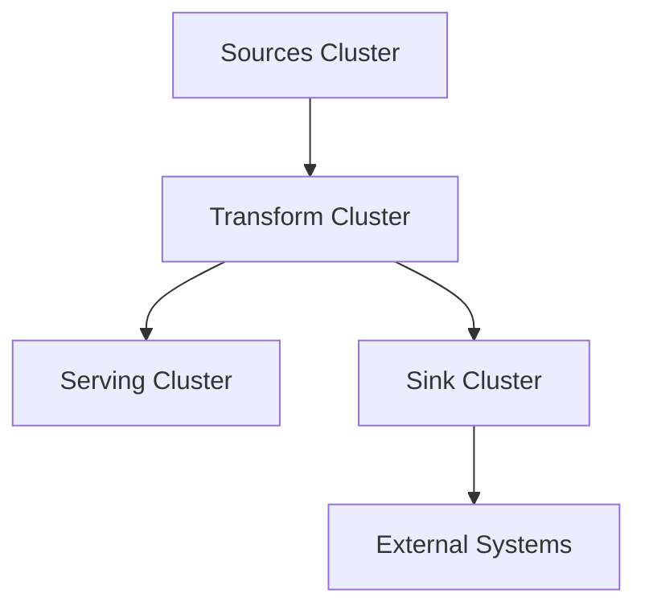

## Overview

Sinks are the inverse of sources — they describe external systems where Materialize writes data. Sinks continuously stream changes from **materialized views**, **sources**, or **tables** to external destinations as soon as changes occur.

```sql
-- Create a materialized view
CREATE MATERIALIZED VIEW customer_summary AS
SELECT 
    customer_id,
    COUNT(*) as order_count,
    SUM(total) as lifetime_value
FROM orders
GROUP BY customer_id;

-- Stream changes to Kafka
CREATE SINK customer_sink
FROM customer_summary
INTO KAFKA CONNECTION kafka_conn (TOPIC 'customer-summary')
FORMAT JSON;
```

<Info>
Sinks enable push-based architectures where downstream systems receive updates immediately without polling.
</Info>

## Kafka Sinks

Materialize supports streaming data to Kafka and Kafka-compatible systems (like Redpanda).

### Creating a Kafka Sink

```sql
-- Create a Kafka connection
CREATE SECRET kafka_password AS '...';

CREATE CONNECTION kafka_conn TO KAFKA (
    BROKER 'broker.kafka.example.com:9092',
    SASL MECHANISMS = 'PLAIN',
    SASL USERNAME = 'user',
    SASL PASSWORD = SECRET kafka_password
);

-- Create a sink from a materialized view
CREATE SINK order_updates_sink
FROM order_updates
INTO KAFKA CONNECTION kafka_conn (TOPIC 'order-updates')
FORMAT JSON
ENVELOPE UPSERT;
```

### Supported Formats

<Tabs>
  <Tab title="JSON">
    ```sql
    CREATE SINK json_sink
    FROM my_view
    INTO KAFKA CONNECTION kafka_conn (TOPIC 'events')
    FORMAT JSON
    ENVELOPE UPSERT;
    ```
    
    **Output Example**:
    ```json
    {
      "customer_id": "CUST-123",
      "order_count": 42,
      "lifetime_value": 5432.10
    }
    ```
  </Tab>
  
  <Tab title="Avro">
    ```sql
    CREATE CONNECTION csr_conn TO CONFLUENT SCHEMA REGISTRY (
        URL 'https://schema-registry.example.com'
    );
    
    CREATE SINK avro_sink
    FROM my_view
    INTO KAFKA CONNECTION kafka_conn (TOPIC 'events')
    FORMAT AVRO USING CONFLUENT SCHEMA REGISTRY CONNECTION csr_conn
    ENVELOPE UPSERT;
    ```
    
    Materialize automatically registers schemas with the schema registry.
  </Tab>
  
  <Tab title="TEXT/BYTES">
    ```sql
    -- Requires single text or bytea column
    CREATE SINK text_sink
    FROM text_data
    INTO KAFKA CONNECTION kafka_conn (TOPIC 'logs')
    FORMAT TEXT;
    ```
  </Tab>
</Tabs>

### Envelopes

<AccordionGroup>
  <Accordion title="Upsert Envelope (Recommended)">
    Maintains the latest state for each key:
    
    ```sql
    CREATE SINK upsert_sink
    FROM customer_summary
    INTO KAFKA CONNECTION kafka_conn (TOPIC 'customers')
    FORMAT JSON
    ENVELOPE UPSERT;
    ```
    
    **Message format**:
    - **Key**: Primary key columns
    - **Value**: All columns (or null for deletions)
    
    **Use when**: Downstream consumers need the current state
  </Accordion>
  
  <Accordion title="Debezium Envelope">
    Provides full CDC information with before/after images:
    
    ```sql
    CREATE SINK debezium_sink
    FROM orders
    INTO KAFKA CONNECTION kafka_conn (TOPIC 'order-changes')
    FORMAT JSON
    ENVELOPE DEBEZIUM;
    ```
    
    **Message format**:
    ```json
    {
      "before": {"id": 1, "status": "pending"},
      "after": {"id": 1, "status": "shipped"},
      "op": "u"
    }
    ```
    
    **Use when**: Downstream systems need full change history
  </Accordion>
</AccordionGroup>

## How Sinks Work

### Incremental Updates

Sinks stream only **changes**, not entire snapshots:

```sql
CREATE MATERIALIZED VIEW inventory AS
SELECT 
    product_id,
    SUM(quantity) as stock
FROM inventory_events
GROUP BY product_id;

CREATE SINK inventory_sink
FROM inventory
INTO KAFKA CONNECTION kafka_conn (TOPIC 'inventory')
FORMAT JSON
ENVELOPE UPSERT;
```

When a new inventory event arrives:

```sql
INSERT INTO inventory_events VALUES ('PROD-123', 10);
```

Materialize:
1. Incrementally updates the `inventory` materialized view
2. Computes the delta: `(product_id='PROD-123', stock: +10)`
3. Emits one message to Kafka with the new stock value

<Info>
Only changed rows are sent — not the entire table. This minimizes bandwidth and downstream processing.
</Info>

### Exactly-Once Semantics

Materialize provides **exactly-once delivery** guarantees:

- Uses Kafka transactions to group related updates
- Handles network failures and retries automatically
- Ensures no duplicate messages in the sink topic

```sql
-- Transactional updates in Materialize
BEGIN;
INSERT INTO orders VALUES (1, 'CUST-1', 100);
INSERT INTO orders VALUES (2, 'CUST-1', 50);
COMMIT;

-- Sink emits both changes in a single Kafka transaction
-- Downstream consumers see atomic updates
```

### Timestamp Watermarks

Every message includes a `materialize-timestamp` header indicating logical time:

```json
{
  "headers": {
    "materialize-timestamp": "1704067200000"
  },
  "key": {"customer_id": "CUST-123"},
  "value": {"customer_id": "CUST-123", "order_count": 42}
}
```

This enables downstream systems to:
- Track data freshness
- Implement time-based processing
- Join data with consistent timestamps

## Message Keys

By default, sinks use the primary key as the message key:

```sql
CREATE MATERIALIZED VIEW customer_summary AS
SELECT 
    customer_id,  -- Primary key
    COUNT(*) as orders
FROM orders
GROUP BY customer_id;

CREATE SINK customer_sink
FROM customer_summary
INTO KAFKA CONNECTION kafka_conn (TOPIC 'customers')
FORMAT JSON
ENVELOPE UPSERT;
```

**Kafka message**:
- **Key**: `{"customer_id": "CUST-123"}`
- **Value**: `{"customer_id": "CUST-123", "orders": 42}`

### Custom Key and Value Formats

```sql
CREATE SINK mixed_format_sink
FROM customer_summary
INTO KAFKA CONNECTION kafka_conn (TOPIC 'customers')
KEY FORMAT TEXT
VALUE FORMAT JSON
ENVELOPE UPSERT;
```

This produces:
- **Key**: `"CUST-123"` (plain text)
- **Value**: `{"customer_id": "CUST-123", "orders": 42}` (JSON)

## Custom Headers

Add custom headers to messages:

```sql
CREATE VIEW events_with_headers AS
SELECT 
    event_id,
    event_type,
    data,
    MAP['source' => 'materialize', 'version' => '1.0'] as headers
FROM events;

CREATE SINK events_sink
FROM events_with_headers
INTO KAFKA CONNECTION kafka_conn (TOPIC 'events')
FORMAT JSON
ENVELOPE UPSERT
HEADERS headers;
```

<Warning>
Headers starting with `materialize-` are reserved and will be ignored.
</Warning>

## Sink from Different Sources

### From Materialized Views

```sql
-- Most common: sink a materialized view
CREATE MATERIALIZED VIEW daily_revenue AS
SELECT 
    DATE_TRUNC('day', order_time) as day,
    SUM(total) as revenue
FROM orders
GROUP BY day;

CREATE SINK revenue_sink
FROM daily_revenue
INTO KAFKA CONNECTION kafka_conn (TOPIC 'revenue')
FORMAT JSON;
```

### From Sources

```sql
-- Pass through source data unchanged
CREATE SOURCE pg_source
FROM POSTGRES CONNECTION pg_conn
(PUBLICATION 'mz_source');

CREATE SINK passthrough_sink
FROM pg_source_orders
INTO KAFKA CONNECTION kafka_conn (TOPIC 'orders-replicated')
FORMAT JSON
ENVELOPE DEBEZIUM;
```

### From Tables

```sql
-- Stream table changes
CREATE TABLE config_changes (
    change_id INT,
    config_key TEXT,
    config_value TEXT
);

CREATE SINK config_sink
FROM config_changes
INTO KAFKA CONNECTION kafka_conn (TOPIC 'config-updates')
FORMAT JSON
ENVELOPE UPSERT;
```

<Info>
Only **materialized** views work with sinks. Regular views cannot be used because they don't maintain incremental state.
</Info>

## Hydration and Initial Load

When a sink is created, it undergoes **hydration** — loading the complete snapshot:

```sql
CREATE SINK customer_sink
FROM customer_summary  -- Contains 1M rows
INTO KAFKA CONNECTION kafka_conn (TOPIC 'customers')
FORMAT JSON
ENVELOPE UPSERT;
```

<Steps>
  <Step title="Load Snapshot">
    Materialize loads the entire current state of `customer_summary` into memory
  </Step>
  <Step title="Emit Messages">
    All 1M rows are emitted to the Kafka topic
  </Step>
  <Step title="Switch to Incremental">
    Sink begins streaming only changes
  </Step>
</Steps>

<Warning>
During hydration, sinks need memory proportional to the entire snapshot. Ensure sufficient cluster memory for large datasets.
</Warning>

## Clusters and Sinks

Sinks require compute resources and must be associated with a cluster:

```sql
-- Create a dedicated cluster for sinks
CREATE CLUSTER sink_cluster SIZE = '50cc';

-- Create sink in that cluster
CREATE SINK my_sink
IN CLUSTER sink_cluster
FROM my_view
INTO KAFKA CONNECTION kafka_conn (TOPIC 'events')
FORMAT JSON;
```

<Tip>
**Best Practice**: Use separate clusters for sources and sinks to avoid resource contention. Sinks can use smaller clusters than sources since they only emit changes.
</Tip>

### Three-Tier Architecture with Sinks



1. **Sources cluster**: Ingests data
2. **Transform cluster**: Materialized views
3. **Serving cluster**: Indexes for queries
4. **Sink cluster**: Streams to external systems

## Monitoring Sinks

### Check Sink Status

```sql
-- View all sinks
SELECT name, type, size FROM mz_sinks;

-- Check sink health
SELECT 
    s.name,
    ss.status,
    ss.error
FROM mz_sinks s
JOIN mz_internal.mz_sink_statuses ss ON s.id = ss.id;
```

### Monitor Write Progress

```sql
-- View sink write progress
SELECT 
    s.name,
    sw.offset,
    sw.timestamp
FROM mz_sinks s
JOIN mz_internal.mz_sink_statistics sw ON s.id = sw.id;
```

### Track Message Volume

```sql
-- Count messages written by sink
SELECT 
    name,
    SUM(messages_written) as total_messages
FROM mz_internal.mz_sink_statistics
JOIN mz_sinks USING (id)
GROUP BY name;
```

## Performance Optimization

### Partition by Key

Kafka topic partitioning is determined by the message key:

```sql
-- Customer ID becomes partition key
CREATE SINK customer_sink
FROM customer_summary  -- Key: customer_id
INTO KAFKA CONNECTION kafka_conn (
    TOPIC 'customers',
    PARTITION COUNT = 10
)
FORMAT JSON
ENVELOPE UPSERT;
```

Messages for the same customer always go to the same partition, maintaining order.

### Batch Size Tuning

Materialize batches messages for efficiency:

```sql
CREATE SINK optimized_sink
FROM my_view
INTO KAFKA CONNECTION kafka_conn (TOPIC 'events')
FORMAT JSON
WITH (
    batch_size = 1000,          -- Messages per batch
    batch_timeout = '100ms'     -- Max wait time
);
```

<Info>
Larger batches improve throughput but increase latency. Tune based on your requirements.
</Info>

## Example: Real-Time Data Pipeline

Build a complete streaming pipeline:

```sql
-- Ingest from PostgreSQL
CREATE SOURCE pg_source
IN CLUSTER source_cluster
FROM POSTGRES CONNECTION pg_conn
(PUBLICATION 'mz_source');

-- Transform: Calculate metrics
CREATE MATERIALIZED VIEW product_metrics
IN CLUSTER transform_cluster AS
SELECT 
    product_id,
    COUNT(DISTINCT customer_id) as unique_customers,
    COUNT(*) as total_orders,
    SUM(quantity) as total_quantity,
    SUM(amount) as total_revenue,
    AVG(amount) as avg_order_value
FROM pg_source_orders
GROUP BY product_id;

-- Sink: Stream to Kafka for downstream analytics
CREATE SINK product_metrics_sink
IN CLUSTER sink_cluster
FROM product_metrics
INTO KAFKA CONNECTION kafka_conn (
    TOPIC 'product-metrics'
)
FORMAT AVRO 
USING CONFLUENT SCHEMA REGISTRY CONNECTION csr_conn
ENVELOPE UPSERT;

-- Sink: Stream to another Kafka topic for alerting
CREATE VIEW high_value_products AS
SELECT * FROM product_metrics
WHERE total_revenue > 100000;

CREATE SINK alerts_sink
IN CLUSTER sink_cluster
FROM high_value_products
INTO KAFKA CONNECTION kafka_conn (
    TOPIC 'high-value-alerts'
)
FORMAT JSON;
```

## Limitations and Considerations

<Warning>
**Current Limitations**:

1. **Kafka only**: Materialize currently supports only Kafka sinks (including Redpanda)
2. **Materialized views required**: Cannot sink from regular views
3. **Memory requirements**: Initial snapshot must fit in cluster memory
4. **No sink pausing**: Sinks cannot be paused, only dropped and recreated
</Warning>

## Best Practices

<AccordionGroup>
  <Accordion title="Separate Sink Clusters">
    Isolate sinks from sources and queries:
    ```sql
    CREATE CLUSTER sink_cluster SIZE = '50cc';
    
    CREATE SINK my_sink
    IN CLUSTER sink_cluster
    FROM my_view
    INTO KAFKA CONNECTION kafka_conn (TOPIC 'events')
    FORMAT JSON;
    ```
  </Accordion>
  
  <Accordion title="Use Upsert for State">
    When downstream needs current state (not change stream):
    ```sql
    CREATE SINK state_sink
    FROM current_state
    INTO KAFKA CONNECTION kafka_conn (TOPIC 'state')
    FORMAT JSON
    ENVELOPE UPSERT;  -- Consumers get latest values
    ```
  </Accordion>
  
  <Accordion title="Use Debezium for Change Logs">
    When downstream needs full change history:
    ```sql
    CREATE SINK changelog_sink
    FROM orders
    INTO KAFKA CONNECTION kafka_conn (TOPIC 'order-changes')
    FORMAT JSON
    ENVELOPE DEBEZIUM;  -- Includes before/after
    ```
  </Accordion>
  
  <Accordion title="Monitor Sink Lag">
    Ensure sinks keep up with upstream changes:
    ```sql
    SELECT 
        name,
        lag
    FROM mz_sinks
    JOIN mz_internal.mz_wallclock_global_lag USING (id)
    WHERE lag > INTERVAL '1 minute';
    ```
  </Accordion>
</AccordionGroup>

## Next Steps

<CardGroup cols={2}>
  <Card title="Configure Clusters" icon="server" href="/concepts/clusters">
    Size clusters for sink workloads
  </Card>
  <Card title="Kafka Integration" icon="rotate" href="/integrations/kafka">
    Detailed Kafka sink setup
  </Card>
  <Card title="SQL Reference" icon="book" href="/sql/create-sink">
    Complete CREATE SINK syntax
  </Card>
  <Card title="Monitoring Guide" icon="chart-line" href="/manage/monitoring">
    Monitor sink performance and health
  </Card>
</CardGroup>
