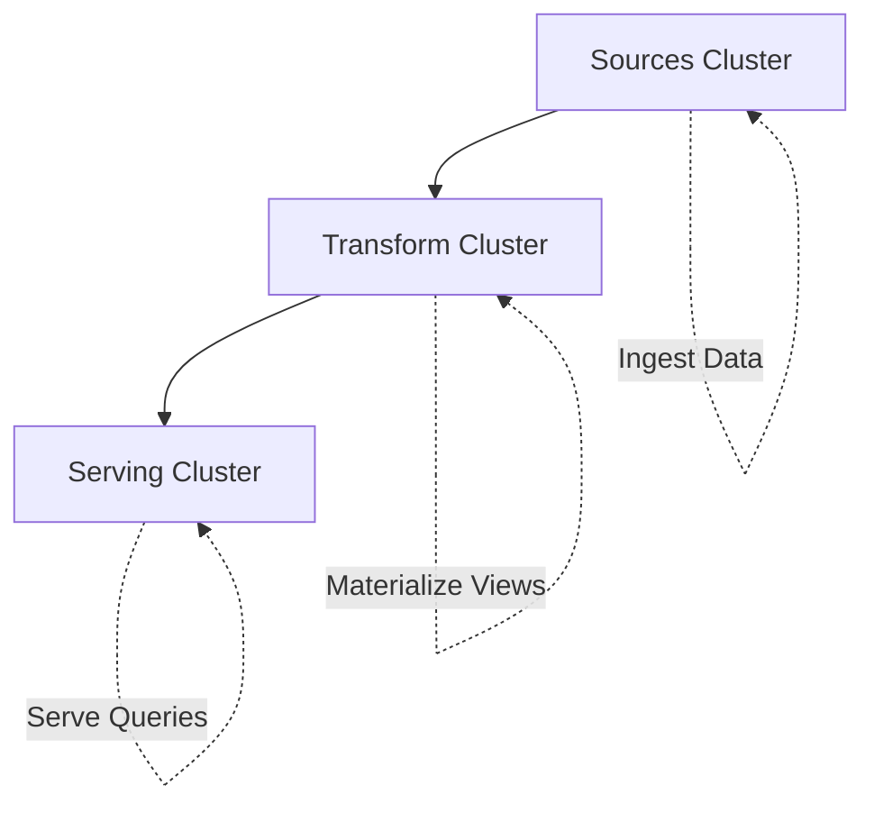

## Overview

Sources describe external systems you want Materialize to read data from. They provide details about how to connect, decode, and interpret streaming data. In SQL terms, sources combine aspects of both **tables** (structured, queryable) and **clients** (responsible for reading data).

<Info>
Sources continuously ingest data changes and make them immediately available for querying. Unlike traditional batch ETL, there's no delay between data arriving in the source system and being queryable in Materialize.
</Info>

## Source Components

Every source consists of three essential components:

<CardGroup cols={3}>
  <Card title="Connector" icon="cable">
    Provides the actual bytes of data
    
    **Example**: Kafka, PostgreSQL
  </Card>
  <Card title="Format" icon="file-code">
    Structures the bytes into schema
    
    **Example**: Avro, JSON, Protobuf
  </Card>
  <Card title="Envelope" icon="envelope">
    Expresses how to handle changes
    
    **Example**: Upsert, Debezium CDC
  </Card>
</CardGroup>

## Native Connectors

Materialize bundles native connectors for the following systems:

### Kafka and Redpanda

Stream events from Kafka-compatible message brokers.

```sql
-- Create a Kafka connection
CREATE SECRET kafka_password AS '...';

CREATE CONNECTION kafka_conn TO KAFKA (
    BROKER 'broker.kafka.example.com:9092',
    SASL MECHANISMS = 'PLAIN',
    SASL USERNAME = 'user',
    SASL PASSWORD = SECRET kafka_password
);

-- Create a source with Avro format
CREATE SOURCE events
FROM KAFKA CONNECTION kafka_conn (TOPIC 'events')
FORMAT AVRO USING CONFLUENT SCHEMA REGISTRY CONNECTION csr_conn;
```

**Supported formats**: Avro, JSON, Protobuf, CSV, Text, Bytes

**Envelopes**: 
- **Upsert**: Key-value updates (maintains latest value per key)
- **Debezium**: Full CDC with before/after images
- **None**: Append-only streams

<Tip>
Kafka sources are extremely efficient. Materialize creates a single replication stream and shares it across all downstream views, minimizing bandwidth and broker load.
</Tip>

### PostgreSQL

Capture real-time changes from PostgreSQL databases using logical replication.

```sql
-- Create a PostgreSQL connection
CREATE SECRET pg_password AS '...';

CREATE CONNECTION pg_conn TO POSTGRES (
    HOST 'postgres.example.com',
    PORT 5432,
    DATABASE 'production',
    USER 'materialize',
    PASSWORD SECRET pg_password
);

-- Create a source for all tables in a publication
CREATE SOURCE pg_source
FROM POSTGRES CONNECTION pg_conn
(PUBLICATION 'mz_source')
FOR ALL TABLES;
```

**How it works**:

1. Materialize creates a **replication slot** in PostgreSQL (prefixed with `materialize_`)
2. Changes are streamed using PostgreSQL's native replication protocol
3. **Subsources** are automatically created for each table in the publication
4. Transactional consistency is maintained — all changes in a transaction get the same timestamp

<Warning>
PostgreSQL 11 or higher is required. You must enable logical replication in the upstream database before creating a source.
</Warning>

**Key benefits**:
- Zero impact on application queries
- Captures `INSERT`, `UPDATE`, and `DELETE` operations
- Maintains transaction boundaries
- No custom triggers or middleware required

### MySQL

Ingest changes from MySQL databases using GTID-based binlog replication.

```sql
-- Create a MySQL connection
CREATE SECRET mysql_password AS '...';

CREATE CONNECTION mysql_conn TO MYSQL (
    HOST 'mysql.example.com',
    PORT 3306,
    USER 'materialize',
    PASSWORD SECRET mysql_password
);

-- Create a source for specific schemas and tables
CREATE SOURCE mysql_source
FROM MYSQL CONNECTION mysql_conn
FOR SCHEMAS (production, staging);
```

**Requirements**:
- MySQL 5.7 or higher
- GTID-based binary logging enabled
- Row-based replication format

**Configuration example**:

```ini
# MySQL server configuration
gtid_mode = ON
enforce_gtid_consistency = ON
binlog_format = ROW
binlog_row_image = FULL
```

### SQL Server

Capture changes from Microsoft SQL Server using Change Data Capture (CDC).

```sql
CREATE CONNECTION sqlserver_conn TO SQL SERVER (
    HOST 'sqlserver.example.com',
    PORT 1433,
    DATABASE 'production',
    USER 'materialize',
    PASSWORD SECRET sqlserver_password
);

CREATE SOURCE sqlserver_source
FROM SQL SERVER CONNECTION sqlserver_conn
FOR TABLES (dbo.orders, dbo.customers);
```

<Info>
SQL Server CDC must be enabled at both the database and table level before creating a source in Materialize.
</Info>

### Webhooks

Receive data pushed via HTTP POST requests.

```sql
-- Create a webhook source
CREATE SOURCE webhook_events FROM WEBHOOK
    BODY FORMAT JSON;

-- Get the webhook URL
SELECT url FROM mz_internal.mz_webhook_sources
WHERE name = 'webhook_events';
```

The webhook URL format:
```
https://<HOST>/api/webhook/<database>/<schema>/<source_name>
```

**Supported body formats**:
- `JSON`: Parse as JSON objects
- `JSON ARRAY`: Expand JSON arrays to individual rows
- `TEXT`: Parse as UTF-8 text
- `BYTES`: Store raw bytes without parsing

**Example with headers**:

```sql
CREATE SOURCE webhook_source FROM WEBHOOK
    BODY FORMAT JSON
    INCLUDE HEADER 'x-event-type' AS event_type
    INCLUDE HEADER 'timestamp' AS event_timestamp;
```

## Change Data Capture (CDC)

Materialize's CDC sources operate on streams of **updates** represented as triples:

```rust
(data, time, diff)
```

- **data**: Row contents
- **time**: Logical timestamp (transaction ID or wall-clock time)
- **diff**: +1 (insert), -1 (delete), or other integers for aggregations

### Debezium Envelope

Debezium provides `before` and `after` records:

```json
{
  "before": {"id": 1, "name": "Alice", "count": 5},
  "after": {"id": 1, "name": "Alice", "count": 10}
}
```

Materialize translates this to:
```
({id: 1, name: "Alice", count: 5}, T, -1)  // Delete old value
({id: 1, name: "Alice", count: 10}, T, +1) // Insert new value
```

### Upsert Envelope

For key-value updates:

```sql
CREATE SOURCE user_profiles
FROM KAFKA CONNECTION kafka_conn (TOPIC 'users')
FORMAT JSON
ENVELOPE UPSERT;
```

Materialize maintains a copy of the key-value mapping to correctly interpret:
- **Insertion**: New key appears
- **Update**: Existing key with new value
- **Deletion**: Key with null value

<Warning>
Upsert sources require additional memory to maintain the key-value state. Consider using indexed views if the upstream system can provide explicit INSERT/UPDATE/DELETE operations.
</Warning>

## Subsources

When creating a source from a database (PostgreSQL, MySQL, SQL Server), Materialize automatically creates **subsources** for each table:

```sql
CREATE SOURCE pg_source
FROM POSTGRES CONNECTION pg_conn
(PUBLICATION 'mz_source')
FOR ALL TABLES;

-- List all subsources
SHOW SOURCES;
```

Output:
```
         name         |   type
----------------------+-----------
 pg_source            | postgres
 pg_source_orders     | subsource
 pg_source_customers  | subsource
 pg_source_products   | subsource
```

Subsources can be queried directly:

```sql
SELECT * FROM pg_source_orders;
```

Or used in views:

```sql
CREATE MATERIALIZED VIEW order_summary AS
SELECT 
    c.customer_name,
    COUNT(*) as order_count,
    SUM(o.total) as total_spent
FROM pg_source_orders o
JOIN pg_source_customers c ON o.customer_id = c.id
GROUP BY c.customer_name;
```

## Sources and Clusters

Sources require compute resources and must be associated with a **cluster**:

```sql
-- Create a dedicated cluster for sources
CREATE CLUSTER source_cluster SIZE = '100cc';

-- Create source in that cluster
CREATE SOURCE kafka_source
IN CLUSTER source_cluster
FROM KAFKA CONNECTION kafka_conn (TOPIC 'events')
FORMAT JSON;
```

<Tip>
**Best Practice**: Dedicate a separate cluster for sources to isolate ingestion workloads from query processing and transformations.
</Tip>

### Three-Tier Architecture



1. **Sources cluster**: Dedicated to data ingestion
2. **Transform cluster**: Hosts materialized views for transformations
3. **Serving cluster**: Indexes materialized views for fast queries

## Performance Considerations

### Replication Slots (PostgreSQL)

Each PostgreSQL source creates one replication slot. The slot name can be found:

```sql
SELECT id, replication_slot 
FROM mz_internal.mz_postgres_sources;
```

<Warning>
If the replication slot falls too far behind, PostgreSQL may run out of disk space. Monitor replication lag and ensure Materialize stays connected.
</Warning>

### Binlog Retention (MySQL)

If Materialize encounters GTID gaps due to missing binlog files, the source enters an error state and must be recreated. Ensure sufficient binlog retention:

```sql
-- Check binlog retention (in seconds)
SHOW VARIABLES LIKE 'binlog_expire_logs_seconds';

-- Set to 7 days
SET GLOBAL binlog_expire_logs_seconds = 604800;
```

### Bandwidth Optimization

Materialize minimizes bandwidth by:
- Sharing a single replication stream across all downstream views
- Only requesting columns actually used in queries
- Applying filters at the source when possible

## Monitoring Sources

Query system catalog to monitor source health:

```sql
-- Check source status
SELECT id, name, type, size
FROM mz_sources;

-- Monitor replication lag
SELECT object_id, lag
FROM mz_internal.mz_wallclock_global_lag
WHERE object_id IN (SELECT id FROM mz_sources);

-- View source errors
SELECT * FROM mz_internal.mz_source_statuses
WHERE status = 'error';
```

## Next Steps

<CardGroup cols={2}>
  <Card title="Create Materialized Views" icon="table" href="/concepts/materialized-views">
    Transform source data with SQL queries
  </Card>
  <Card title="Configure Clusters" icon="server" href="/concepts/clusters">
    Optimize compute resources for sources
  </Card>
  <Card title="SQL Reference" icon="book" href="/sql/create-source">
    Complete CREATE SOURCE syntax
  </Card>
  <Card title="Integration Guides" icon="plug" href="/integrations">
    Step-by-step setup for each connector
  </Card>
</CardGroup>
